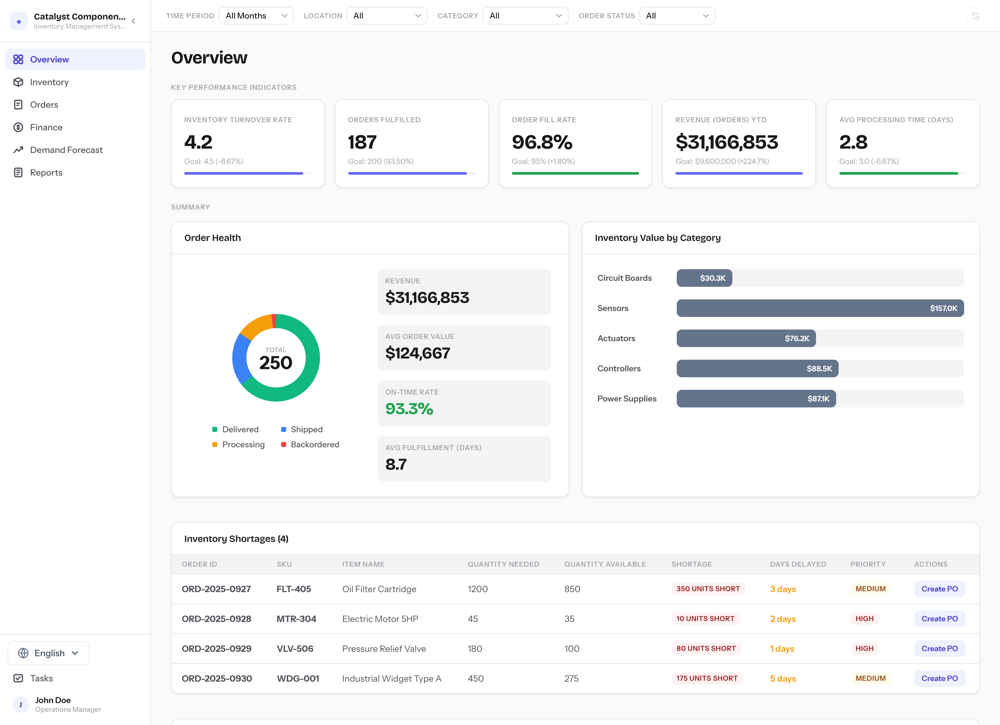
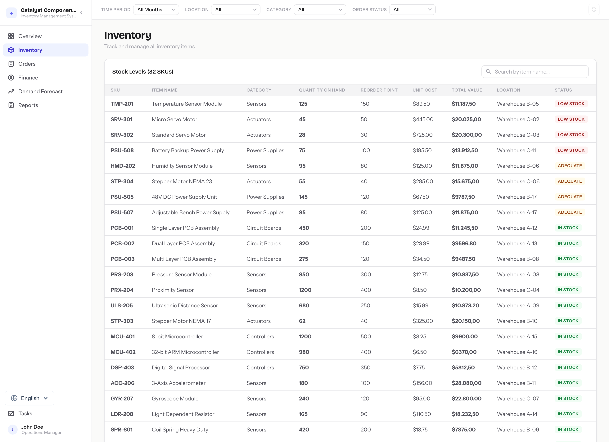
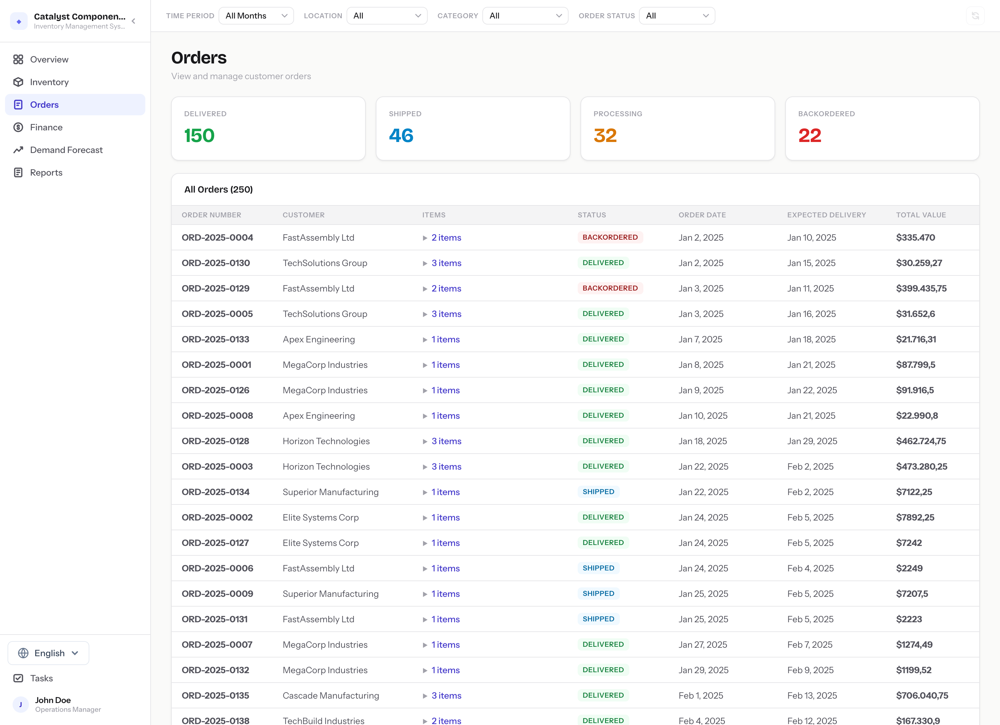
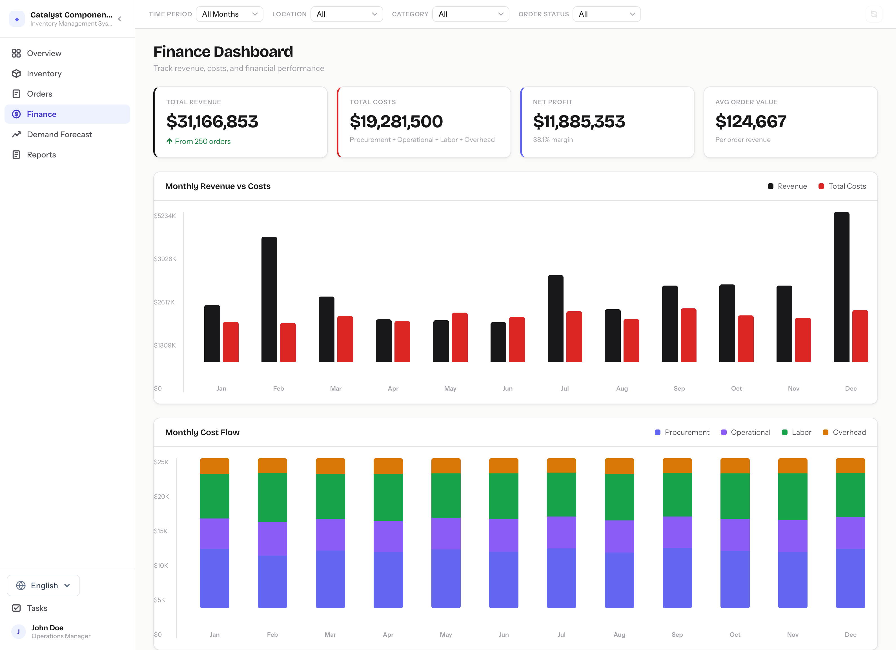
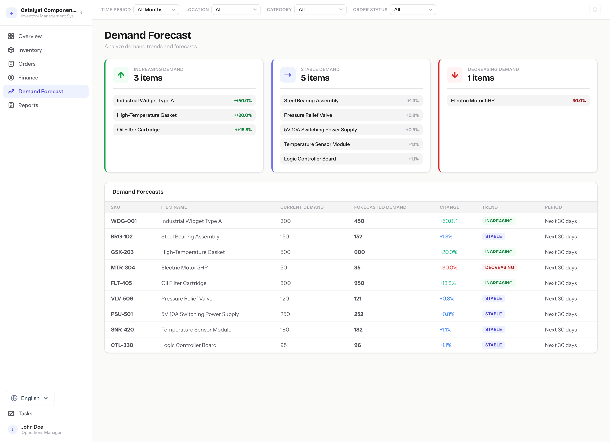
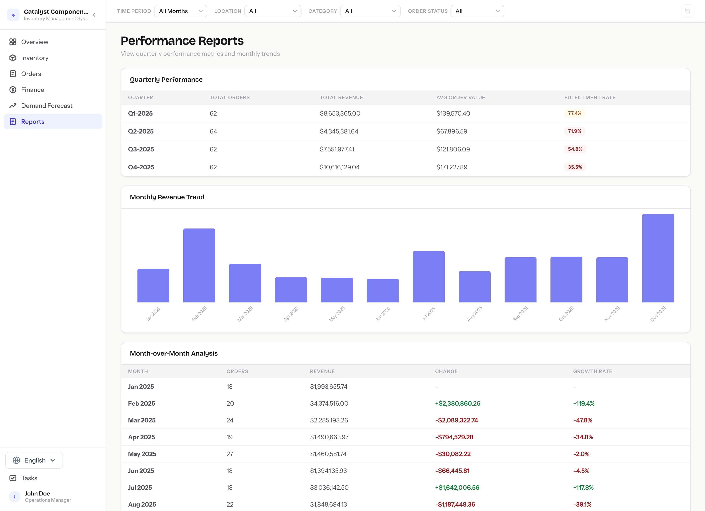

# Functional Documentation — Inventory Management System

**Catalyst Components · Inventory Management System**

A full-stack factory inventory management demo built with Vue 3 (frontend) and Python FastAPI (backend). All data is in-memory mock data — no database required.

---

## Table of Contents

1. [Application Layout](#application-layout)
2. [Global Filter Bar](#global-filter-bar)
3. [Overview (Dashboard)](#overview-dashboard)
4. [Inventory](#inventory)
5. [Orders](#orders)
6. [Finance](#finance)
7. [Demand Forecast](#demand-forecast)
8. [Performance Reports](#performance-reports)
9. [Tech Stack](#tech-stack)

---

## Application Layout

The app uses a modern SaaS-style layout with:

- **Left sidebar** — collapsible navigation with links to all six sections, user profile (John Doe, Operations Manager), language selector, and task panel button
- **Top filter bar** — four global filters that propagate to every page
- **Main content area** — section-specific data, charts, and tables

---

## Global Filter Bar

The filter bar appears at the top of every page and controls all data displayed across the application.

| Filter | Options |
|---|---|
| Time Period | All Months, January – December |
| Location | All, San Francisco, London, Tokyo |
| Category | All, Circuit Boards, Sensors, Actuators, Controllers, Power Supplies |
| Order Status | All, Delivered, Shipped, Processing, Backordered |

Filters are passed as query parameters to the FastAPI backend. A **Reset all filters** button clears all selections at once (enabled only when at least one filter is active).

---

## Overview (Dashboard)

**Route:** `/`

The central command center for operations. Provides a real-time snapshot of the entire business.



### Key Performance Indicators (KPIs)

Five KPI cards at the top of the page, each showing the current value, the goal, and percentage deviation:

| KPI | Value | Goal |
|---|---|---|
| Inventory Turnover Rate | 4.2 | 4.5 |
| Orders Fulfilled | 187 | 200 |
| Order Fill Rate | 96.8% | 95% |
| Revenue (Orders) YTD | $31,166,853 | $9,600,000 |
| Avg Processing Time (Days) | 2.8 | 3.0 |

### Summary Section

**Order Health card** — A donut chart showing 250 total orders broken down by status (Delivered / Shipped / Processing / Backordered), alongside revenue ($31,166,853), average order value ($124,667), on-time rate (93.3%), and average fulfillment time (8.7 days).

**Inventory Value by Category** — A horizontal bar chart displaying the total stock value for each product category (Sensors leads at $157K).

**Inventory Shortages** — An action table listing orders that are currently blocked by insufficient stock, with columns for Order ID, SKU, shortage quantity, days delayed, priority (High/Medium), and a **Create PO** button to initiate a purchase order for each shortage.

**Top Products by Revenue** — A ranked table of the highest-revenue SKUs showing category, units ordered, total revenue, first order date, and stock status.

---

## Inventory

**Route:** `/inventory`

Full catalog of all 32 SKUs with real-time stock status and warehouse location.



### Stock Levels Table

Columns: SKU · Item Name · Category · Quantity on Hand · Reorder Point · Unit Cost · Total Value · Location · Status

**Status badge logic:**
- **Low Stock** (red) — quantity on hand is below the reorder point
- **Adequate** (orange) — quantity is at or slightly above the reorder point
- **In Stock** (green) — quantity comfortably exceeds the reorder point

### Features

- **Search** — filter the table live by item name using the search box
- **Filterable by category and location** — uses the global filter bar
- **32 SKUs** across five categories: Circuit Boards, Sensors, Actuators, Controllers, Power Supplies
- Warehouses: A-xx, B-xx, C-xx location codes

---

## Orders

**Route:** `/orders`

Full order management view for 250 customer orders across the year.



### Status Summary Cards

Four summary cards at the top give an instant status breakdown:

| Status | Count |
|---|---|
| Delivered | 150 |
| Shipped | 46 |
| Processing | 32 |
| Backordered | 22 |

### All Orders Table

Columns: Order Number · Customer · Items (expandable) · Status · Order Date · Expected Delivery · Total Value

- **Color-coded status badges** — green (Delivered), blue (Shipped), orange (Processing), red (Backordered)
- **Filterable** by time period, location, category, and order status via the global filter bar
- Orders from customers including: FastAssembly Ltd, TechSolutions Group, Apex Engineering, MegaCorp Industries, Horizon Technologies, Superior Manufacturing, Elite Systems Corp

---

## Finance

**Route:** `/spending`

Financial performance dashboard tracking revenue, costs, and profit margin.



### Summary KPIs

| Metric | Value |
|---|---|
| Total Revenue | $31,166,853 |
| Total Costs | $19,281,500 |
| Net Profit | $11,885,353 (38.1% margin) |
| Avg Order Value | $124,667 |

### Monthly Revenue vs Costs Chart

A dual bar chart (black = Revenue, red = Total Costs) showing all 12 months side by side — makes revenue-to-cost gaps immediately visible.

### Monthly Cost Flow Chart

A stacked bar chart breaking down each month's costs into four layers:
- **Procurement** (blue)
- **Operational** (purple)
- **Labor** (green)
- **Overhead** (orange)

### Spending by Category

Four category cards with spend totals and YoY growth rates:
- Raw Materials — $2,562,000 (+15.2%)
- Components — $2,946,000 (+10.5%)
- Equipment — $1,442,400 (+8.3%)
- Consumables — $1,767,000 (+12.7%)

### Recent Transactions Table

Full ledger of individual transactions with columns: Transaction ID · Description · Vendor · Date · Amount. Covers vendors such as Industrial Supply Co, MotorTech Solutions, FilterMax Inc, Valve Systems Corp, Widget World Inc.

---

## Demand Forecast

**Route:** `/demand`

Forward-looking demand analysis for the next 30 days across all key SKUs.



### Trend Summary Cards

Three cards categorize all tracked items by demand direction:

| Trend | Count | Items |
|---|---|---|
| Increasing | 3 | Industrial Widget Type A (+50%), High-Temp Gasket (+20%), Oil Filter Cartridge (+18.8%) |
| Stable | 5 | Steel Bearing Assembly, Pressure Relief Valve, 5V Power Supply, Temp Sensor, Logic Controller |
| Decreasing | 1 | Electric Motor 5HP (-30%) |

### Demand Forecasts Table

Columns: SKU · Item Name · Current Demand · Forecasted Demand · Change · Trend · Period

Color-coded trend badges — green (INCREASING), blue (STABLE), red (DECREASING) — make outliers scannable at a glance. All forecasts cover the next 30 days.

---

## Performance Reports

**Route:** `/reports`

Historical performance analysis with quarterly summaries and monthly trends.



### Quarterly Performance Table

| Quarter | Orders | Revenue | Avg Order Value | Fulfillment Rate |
|---|---|---|---|---|
| Q1-2025 | 62 | $8,653,365 | $139,570 | 77.4% |
| Q2-2025 | 64 | $4,345,382 | $67,897 | 71.9% |
| Q3-2025 | 62 | $7,551,977 | $121,806 | 54.8% |
| Q4-2025 | 62 | $10,616,129 | $171,228 | 35.5% |

### Monthly Revenue Trend Chart

A bar chart spanning January–December 2025 showing month-level revenue — peaks visible in February ($4.4M) and December ($5.2M).

### Month-over-Month Analysis Table

Columns: Month · Orders · Revenue · Change (absolute) · Growth Rate (%)

Positive growth is shown in green, negative in red. Largest gains: Feb (+119.4%), Jul (+117.8%), Dec (+96.1%).

### Summary Footer

| | Value |
|---|---|
| Total Revenue (YTD) | $31,166,853 |
| Avg Monthly Revenue | $2,597,238 |
| Total Orders (YTD) | 250 |
| Best Performing Quarter | Q4-2025 |

---

## Tech Stack

| Layer | Technology |
|---|---|
| Frontend | Vue 3 + Composition API + Vite (port 3000) |
| Backend | Python FastAPI (port 8001) |
| Data | JSON files in `server/data/`, loaded via `server/mock_data.py` |
| Charts | Custom SVG bar/donut charts |
| Styling | CSS Grid, custom design tokens (slate/gray palette) |

### Data Flow

```
Vue filters → api.js (axios) → FastAPI endpoints → in-memory filtering → Pydantic validation → component computed properties
```

### API Endpoints

| Endpoint | Filters supported |
|---|---|
| `GET /api/inventory` | warehouse, category |
| `GET /api/orders` | warehouse, category, status, month |
| `GET /api/dashboard/summary` | all filters |
| `GET /api/demand` | none |
| `GET /api/spending/*` | none |
